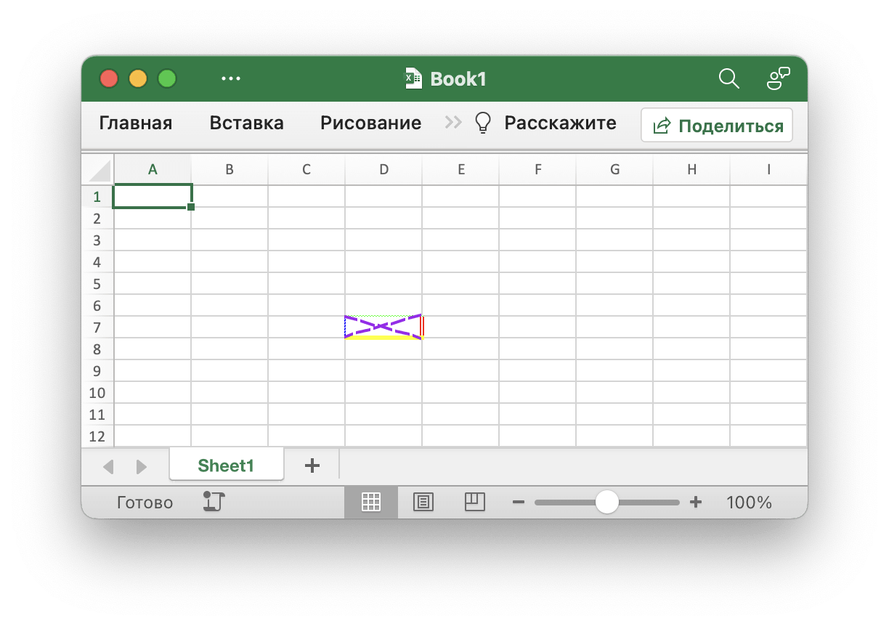
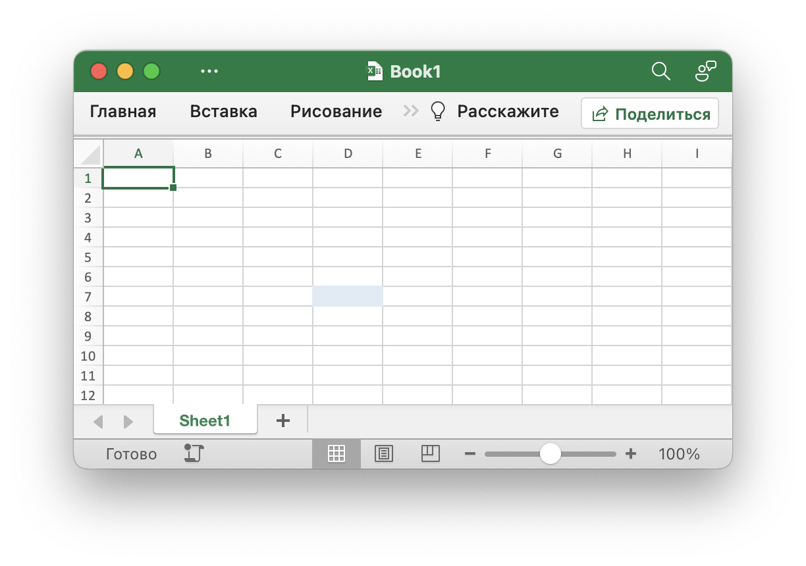
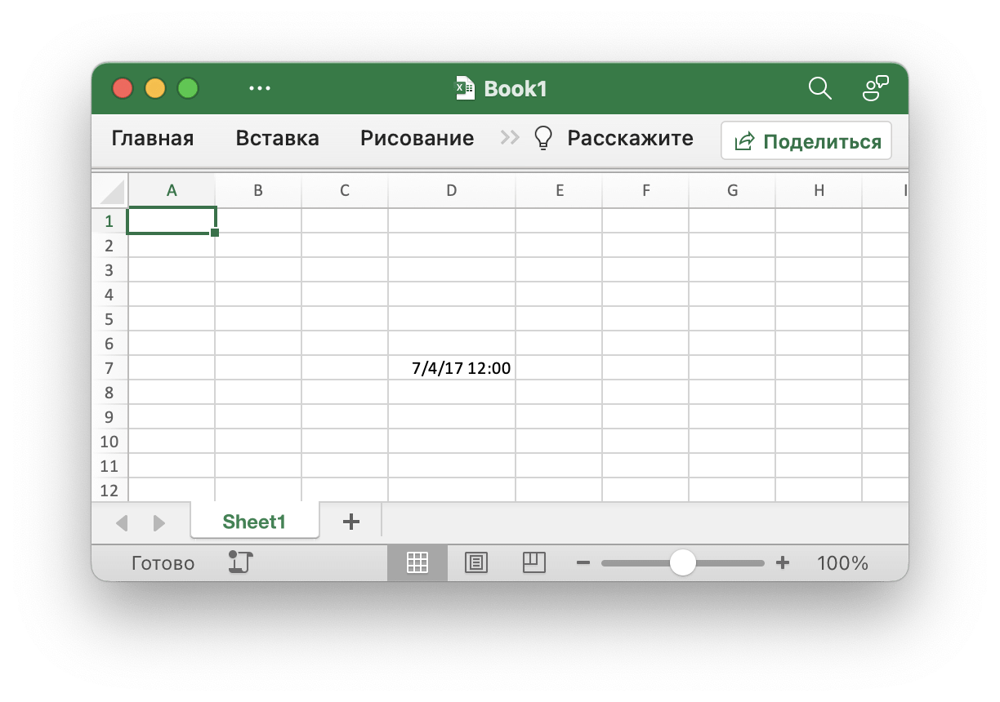
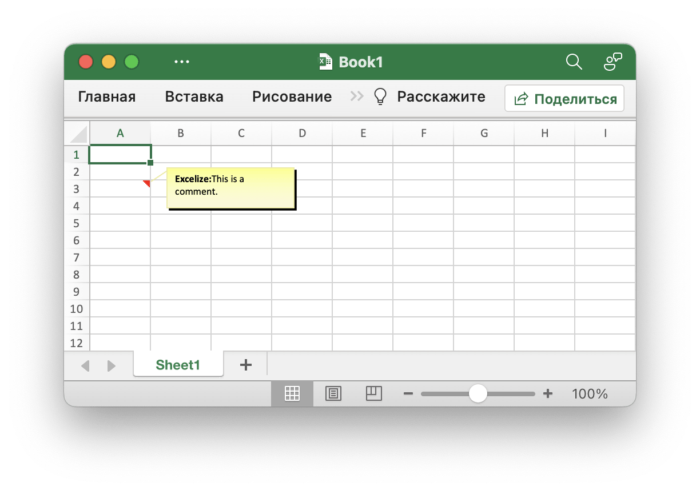

# клетка

RichTextRun напрямую отображает настройки прогона расширенного текста.

```go
type RichTextRun struct {
    Font *Font
    Text string
}
```

HyperlinkOpts можно передать в [`SetCellHyperlink`](cell.md#SetCellHyperlink) для установки дополнительных атрибутов гиперссылки (например, отображаемого текста и текста подсказки на экране).

```go
type HyperlinkOpts struct {
    Display *string
    Tooltip *string
}
```

## Установить значение ячейки {#SetCellValue}

```go
func (f *File) SetCellValue(sheet, axis string, value interface{}) error
```

SetCellValue предоставляет функцию для установки значения ячейки. Указанные координаты не должны быть в первом ряду таблицы. Ниже приведены поддерживаемые типы данных:

|Поддерживаемые типы данных|
|---|
|int|
|int8|
|int16|
|int32|
|int64|
|uint|
|uint8|
|uint16|
|uint32|
|uint64|
|float32|
|float64|
|string|
|[]byte|
|time.Duration|
|time.Time|
|bool|
|nil|

## Установить логическое значение {#SetCellBool}

```go
func (f *File) SetCellBool(sheet, axis string, value bool) error
```

SetCellBool предоставляет функцию для установки значения типа bool ячейки с помощью заданного имени листа, координат ячейки и значения ячейки.

## Установить значение RAW {#SetCellDefault}

```go
func (f *File) SetCellDefault(sheet, axis, value string) error
```

SetCellDefault предоставляет функцию для установки значения типа строки ячейки как формата по умолчанию, не выходя из ячейки.

## Установить целочисленное значение {#SetCellInt}

```go
func (f *File) SetCellInt(sheet, axis string, value int) error
```

SetCellInt предоставляет функцию для установки значения типа int ячейки с помощью заданного имени листа, координат ячейки и значения ячейки.

## Установить строковое значение {#SetCellStr}

```go
func (f *File) SetCellStr(sheet, axis, value string) error
```

SetCellStr предоставляет функцию для установки значения типа строки для ячейки. Общее количество символов, которое ячейка может содержать символы `32767`.

## Установить стиль ячейки {#SetCellStyle}

```go
func (f *File) SetCellStyle(sheet, hcell, vcell string, styleID int) error
```

SetCellStyle предоставляет функцию добавления атрибута стиля для ячеек по заданному имени рабочего листа, области координат и идентификатору стиля. Индексы стиля можно получить с помощью функции [`NewStyle`](style.md#NewStyle). Обратите внимание, что границы `diagonalDown` и `diagonalUp` должны использоваться одинаковым цветом в одной и той же координатной области.

- Пример 1, создайте границы ячейки `D7` на` Sheet1`:

```go
style, err := f.NewStyle(`{
    "border": [
    {
        "type": "left",
        "color": "0000FF",
        "style": 3
    },
    {
        "type": "top",
        "color": "00FF00",
        "style": 4
    },
    {
        "type": "bottom",
        "color": "FFFF00",
        "style": 5
    },
    {
        "type": "right",
        "color": "FF0000",
        "style": 6
    },
    {
        "type": "diagonalDown",
        "color": "A020F0",
        "style": 7
    },
    {
        "type": "diagonalUp",
        "color": "A020F0",
        "style": 8
    }]
}`)
if err != nil {
    fmt.Println(err)
}
err = f.SetCellStyle("Sheet1", "D7", "D7", style)
```



Четыре границы ячейки `D7` установлены с разными стилями и цветами. Это связано с параметрами при вызове функции [`NewStyle`](style.md#NewStyle). Вам нужно установить разные стили для ссылки на документацию для этой главы.

- Пример 2, установив стиль градиента для ячейки `D7` листа `Sheet1`:

```go
style, err := f.NewStyle(`{"fill":{"type":"gradient","color":["#FFFFFF","#E0EBF5"],"shading":1}}`)
if err != nil {
    fmt.Println(err)
}
err = f.SetCellStyle("Sheet1", "D7", "D7", style)
```


В ячейке `D7` задается цветовая заливка эффекта градиента. Эффект градиентной заливки связан с параметром при вызове функции [`NewStyle`](style.md#NewStyle). Вам нужно установить разные стили для ссылки на документацию этой главы.

- Пример 3, установите сплошную заливку для ячейки `D7` с именем `Sheet1`:

```go
style, err := f.NewStyle(`{"fill":{"type":"pattern","color":["#E0EBF5"],"pattern":1}}`)
if err != nil {
    fmt.Println(err)
}
err = f.SetCellStyle("Sheet1", "D7", "D7", style)
```



Ячейка `D7` установлена с заполнением.

- Пример 4, задайте расстояние между символами и угол поворота для ячейки `D7` с именем `Sheet1`:

```go
f.SetCellValue("Sheet1", "D7", "样式")
style, err := f.NewStyle(`{
    "alignment":
    {
        "horizontal": "center",
        "ident": 1,
        "justify_last_line": true,
        "reading_order": 0,
        "relative_indent": 1,
        "shrink_to_fit": true,
        "text_rotation": 45,
        "vertical": "",
        "wrap_text": true
    }
}`)
if err != nil {
    fmt.Println(err)
}
err = f.SetCellStyle("Sheet1", "D7", "D7", style)
```


- Пример 5, дата и время в Excel представлены действительными числами, например `2017/7/4  12:00:00 PM` могут быть представлены числом `42920.5`. Установите формат времени для ячейки таблицы `D7` с именем `Sheet1`:

```go
f.SetCellValue("Sheet1", "D7", 42920.5)
f.SetColWidth("Sheet1", "D", "D", 13)
style, err := f.NewStyle(`{"number_format": 22}`)
if err != nil {
    fmt.Println(err)
}
err = f.SetCellStyle("Sheet1", "D7", "D7", style)
```



В ячейке `D7` установлен формат времени. Обратите внимание, что когда ширина ячейки с применяемым временным форматом слишком узкая, чтобы ее можно было полностью отобразить, она будет отображаться как `####`, вы можете перетащить ширину столбца или установить столбец в соответствующий размер, вызвав `SetColWidth`, чтобы сделать его нормальным. дисплей.

- Пример 6, установив шрифт, размер шрифта, цвет и стиль перекоса для ячейки `D7` листа `Sheet1`:

```go
f.SetCellValue("Sheet1", "D7", "Excel")
style, err := f.NewStyle(`{
    "font":
    {
        "bold": true,
        "italic": true,
        "family": "Times New Roman",
        "size": 36,
        "color": "#777777"
    }
}`)
if err != nil {
    fmt.Println(err)
}
err = f.SetCellStyle("Sheet1", "D7", "D7", style)
```

<p align="center"></p>

- Пример 7, блокировка и скрытие ячейки `D7` с именем `Sheet1`:

```go
style, err := f.NewStyle(`{"protection":{"hidden":true, "locked":true}}`)
if err != nil {
    fmt.Println(err)
}
err = f.SetCellStyle("Sheet1", "D7", "D7", style)
```

Чтобы заблокировать ячейку или скрыть формулу, защитите рабочий лист. На вкладке «Обзор» нажмите «Защитить рабочий лист».

## Установить гиперссылку {#SetCellHyperLink}

```go
func (f *File) SetCellHyperLink(sheet, axis, link, linkType string) error
```

SetCellHyperLink предоставляет функцию для установки гиперссылки на ячейки с помощью заданного имени рабочего листа и URL-адреса URL-адреса. LinkType определяет два типа гиперссылки `External` для сайта или `Location` для перехода к одной из сот в этой книге. Максимальный лимит гиперссылок на листе составляет `65530`. Ниже приведен пример внешней ссылки.

- Пример 1, добавление внешней ссылки на ячейку `A3` на листе с именем `Sheet1`:

```go
err := f.SetCellHyperLink("Sheet1", "A3",
    "https://github.com/360EntSecGroup-Skylar/excelize", "External")
// Задайте стиль шрифта и подчеркивания для ячейки
style, err := f.NewStyle(`{"font":{"color":"#1265BE","underline":"single"}}`)
err = f.SetCellStyle("Sheet1", "A3", "A3", style)
```

- Пример 2: добавление внутренней ссылки на ячейку `A3` с именем `Sheet1`:

```go
err := f.SetCellHyperLink("Sheet1", "A3", "Sheet1!A40", "Location")
```

## Установить форматированный текст для ячейки {#SetCellRichText}

```go
func (f *File) SetCellRichText(sheet, cell string, runs []RichTextRun) error
```

SetCellRichText предоставляет функцию для установки ячейки с расширенным текстом по заданному рабочему листу.

Например, установите расширенный текст в ячейке `A1` листа с именем `Sheet1`:

<p align="center"></p>

```go
package main

import (
    "fmt"

    "github.com/360EntSecGroup-Skylar/excelize/v2"
)

func main() {
    f := excelize.NewFile()
    if err := f.SetRowHeight("Sheet1", 1, 35); err != nil {
        fmt.Println(err)
        return
    }
    if err := f.SetColWidth("Sheet1", "A", "A", 44); err != nil {
        fmt.Println(err)
        return
    }
    if err := f.SetCellRichText("Sheet1", "A1", []excelize.RichTextRun{
        {
            Text: "bold",
            Font: &excelize.Font{
                Bold:   true,
                Color:  "2354e8",
                Family: "Times New Roman",
            },
        },
        {
            Text: " and ",
            Font: &excelize.Font{
                Family: "Times New Roman",
            },
        },
        {
            Text: "italic",
            Font: &excelize.Font{
                Bold:   true,
                Color:  "e83723",
                Italic: true,
                Family: "Times New Roman",
            },
        },
        {
            Text: "text with color and font-family,",
            Font: &excelize.Font{
                Bold:   true,
                Color:  "2354e8",
                Family: "Times New Roman",
            },
        },
        {
            Text: "\r\nlarge text with ",
            Font: &excelize.Font{
                Size:  14,
                Color: "ad23e8",
            },
        },
        {
            Text: "strike",
            Font: &excelize.Font{
                Color:  "e89923",
                Strike: true,
            },
        },
        {
            Text: " and ",
            Font: &excelize.Font{
                Size:  14,
                Color: "ad23e8",
            },
        },
        {
            Text: "underline.",
            Font: &excelize.Font{
                Color:     "23e833",
                Underline: "single",
            },
        },
    }); err != nil {
        fmt.Println(err)
        return
    }
    style, err := f.NewStyle(&excelize.Style{
        Alignment: &excelize.Alignment{
            WrapText: true,
        },
    })
    if err != nil {
        fmt.Println(err)
        return
    }
    if err := f.SetCellStyle("Sheet1", "A1", "A1", style); err != nil {
        fmt.Println(err)
        return
    }
    if err := f.SaveAs("Book1.xlsx"); err != nil {
        fmt.Println(err)
    }
}
```

## Получить форматированный текст ячейки {#GetCellRichText}

```go
func (f *File) GetCellRichText(sheet, cell string) (runs []RichTextRun, err error)
```

GetCellRichText предоставляет функцию для получения форматированного текста ячеек по заданному листу.

## Получить значение ячейки {#GetCellValue}

```go
func (f *File) GetCellValue(sheet, axis string) (string, error)
```

Значение ячейки извлекается в соответствии с данным рабочим листом и координатами ячейки, а возвращаемое значение преобразуется в тип `string`. Если формат ячейки можно применить к значению ячейки, прикладное значение будет возвращено, иначе исходное значение будет возвращено.

## Получить все значения ячейки по столбцам {#GetCols}

Получает значение всех ячеек по столбцам на рабочем листе на основе заданного имени рабочего листа (с учетом регистра), возвращаемого в виде двумерного массива, где значение ячейки преобразуется в тип `string`. Если формат ячейки можно применить к значению ячейки, будет использовано примененное значение, в противном случае будет использовано исходное значение.

Например, получить и пройти значение всех ячеек по столбцам на листе с именем `Sheet1`:

```go
cols, err := f.GetCols("Sheet1")
if err != nil {
    fmt.Println(err)
    return
}
for _, col := range cols {
    for _, rowCell := range col {
        fmt.Print(rowCell, "\t")
    }
    fmt.Println()
}
```

## Получить все значения ячеек по строкам {#GetRows}

```go
func (f *File) GetRows(sheet string) ([][]string, error)
```

Получает значение всех ячеек по строкам на рабочем листе на основе заданного имени рабочего листа (с учетом регистра), возвращаемого в виде двумерного массива, где значение ячейки преобразуется в тип `string`. Если формат ячейки можно применить к значению ячейки, будет использовано примененное значение, в противном случае будет использовано исходное значение.

Например, получить и пройти значение всех ячеек по строкам на листе с именем `Sheet1`:

```go
rows, err := f.GetRows("Sheet1")
if err != nil {
    fmt.Println(err)
    return
}
for _, row := range rows {
    for _, colCell := range row {
        fmt.Print(colCell, "\t")
    }
    fmt.Println()
}
```

## Получить гиперссылку {#GetCellHyperLink}

```go
func (f *File) GetCellHyperLink(sheet, axis string) (bool, string, error)
```

Получает гиперссылку на ячейку на основе заданного имени листа (с учетом регистра) и координат ячейки. Если ячейка имеет гиперссылку, она вернет `true` и адрес ссылки, иначе он вернет `false` и пустой адрес ссылки.

Например, получите гиперссылку на ячейку `H6` на листе с именем `Sheet1`:

```go
link, target, err := f.GetCellHyperLink("Sheet1", "H6")
```

## Получить индекс стиля {#GetCellStyle}

```go
func (f *File) GetCellStyle(sheet, axis string) (int, error)
```

Индекс стиля ячейки получается из заданного имени листа (с учетом регистра) и координат ячейки, а полученный индекс может использоваться как параметр для вызова функции `SetCellValue` при копировании стиля ячейки.

## Объединить ячейки {#MergeCell}

```go
func (f *File) MergeCell(sheet, hcell, vcell string) error
```

Объединить ячейки на основе заданного имени листа (с учетом регистра) и областей координат ячейки. Например, слияние ячеек в области `D3:E9` на листе с именем `Sheet1`:

```go
err := f.MergeCell("Sheet1", "D3", "E9")
```

Если заданная координатная область ячейки перекрывается с другими существующими объединенными ячейками, существующие объединенные ячейки будут удалены.

## Отменить объединение ячеек {#UnmergeCell}

```go
func (f *File) UnmergeCell(sheet string, hcell, vcell string) error
```

UnmergeCell предоставляет функцию для объединения заданной координатной области. Например, удалите область `D3:E9` на `Sheet1`:

```go
err := f.UnmergeCell("Sheet1", "D3", "E9")
```

Внимание: перекрывающиеся области также не будут объединены.

## Получить ячейки слияния {#GetMergeCells}

GetMergeCells предоставляет функцию для получения всех объединенных ячеек из рабочего листа.

```go
func (f *File) GetMergeCells(sheet string) ([]MergeCell, error)
```

## Добавить комментарий {#AddComment}

```go
func (f *File) AddComment(sheet, cell, format string) error
```

AddComment предоставляет метод добавления комментариев в листе с помощью заданного индекса, набора ячеек и формата (например, автора и текста). Обратите внимание, что максимальная длина автора равна 255, а максимальная длина текста - 32512. Например, добавьте комментарий в `Sheet1!$A$3`:



```go
err := f.AddComment("Sheet1", "A3", `{"author":"Excelize: ","text":"This is a comment."}`)
```

## Получить комментари {#GetComments}

```go
func (f *File) GetComments() (comments map[string][]Comment)
```

GetComments извлекает все комментарии и возвращает карту имени рабочего листа в комментарии рабочего листа.

## Установить формулу ячейки {#SetCellFormula}

```go
func (f *File) SetCellFormula(sheet, axis, formula string, opts ...FormulaOpts) error
```

Формула на ячейке берется согласно заданному имени листа (с учетом регистра) и настройкам формулы ячейки. Результат формулы вычисляется, когда рабочий лист открывается приложением Office Excel, а Excelize в настоящее время не предоставляет механизм вычисления формулы, поэтому результаты формулы не могут быть рассчитаны.

## Получить формулу ячейки {#GetCellFormula}

```go
func (f *File) GetCellFormula(sheet, axis string) (string, error)
```

Получите формулу в ячейке на основе заданного имени листа (с учетом регистра) и координат ячейки.

## Рассчитать значение ячейки {#CalcCellValue}

```go
func (f *File) CalcCellValue(sheet, cell string) (result string, err error)
```

CalcCellValue предоставляет функцию для получения вычисленного значения ячейки. Эта функция в настоящее время находится в рабочей обработке. Формула массива, формула таблицы и некоторые другие формулы в настоящее время не поддерживаются.

Поддерживаемые формулы:

```text
ABS
ACOS
ACOSH
ACOT
ACOTH
AND
ARABIC
ASIN
ASINH
ATAN
ATAN2
ATANH
AVERAGE
AVERAGEA
BASE
BIN2DEC
BIN2HEX
BIN2OCT
BITAND
BITLSHIFT
BITOR
BITRSHIFT
BITXOR
CEILING
CEILING.MATH
CEILING.PRECISE
CHAR
CHOOSE
CLEAN
CODE
COLUMN
COLUMNS
COMBIN
COMBINA
CONCAT
CONCATENATE
COS
COSH
COT
COTH
COUNT
COUNTA
COUNTBLANK
CSC
CSCH
DATE
DEC2BIN
DEC2HEX
DEC2OCT
DECIMAL
DEGREES
ENCODEURL
EVEN
EXACT
EXP
FACT
FACTDOUBLE
FALSE
FIND
FINDB
FISHER
FISHERINV
FLOOR
FLOOR.MATH
FLOOR.PRECISE
GAMMA
GAMMALN
GCD
HEX2BIN
HEX2DEC
HEX2OCT
HLOOKUP
IF
IFERROR
INT
ISBLANK
ISERR
ISERROR
ISEVEN
ISNA
ISNONTEXT
ISNUMBER
ISODD
ISTEXT
ISO.CEILING
KURT
LARGE
LCM
LEFT
LEFTB
LEN
LENB
LN
LOG
LOG10
LOOKUP
LOWER
MAX
MDETERM
MEDIAN
MID
MIDB
MIN
MINA
MOD
MROUND
MULTINOMIAL
MUNIT
NA
NOT
OCT2BIN
OCT2DEC
OCT2HEX
ODD
OR
PERMUT
PI
POWER
PRODUCT
PROPER
QUOTIENT
RADIANS
RAND
RANDBETWEEN
REPLACE
REPLACEB
REPT
RIGHT
RIGHTB
ROMAN
ROUND
ROUNDDOWN
ROUNDUP
ROW
ROWS
SEC
SECH
SHEET
SIGN
SIN
SINH
SMALL
SQRT
SQRTPI
STDEV
STDEVA
SUBSTITUTE
SUM
SUMIF
SUMSQ
TAN
TANH
TRIM
TRUE
TRUNC
UNICHAR
UNICODE
UPPER
VLOOKUP
```
