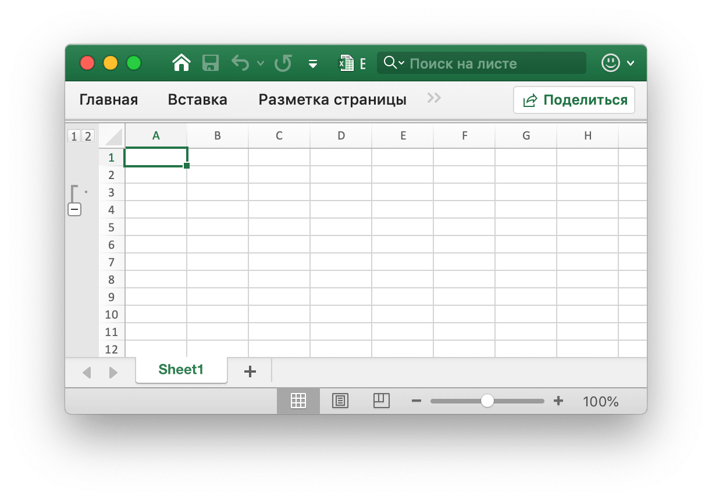
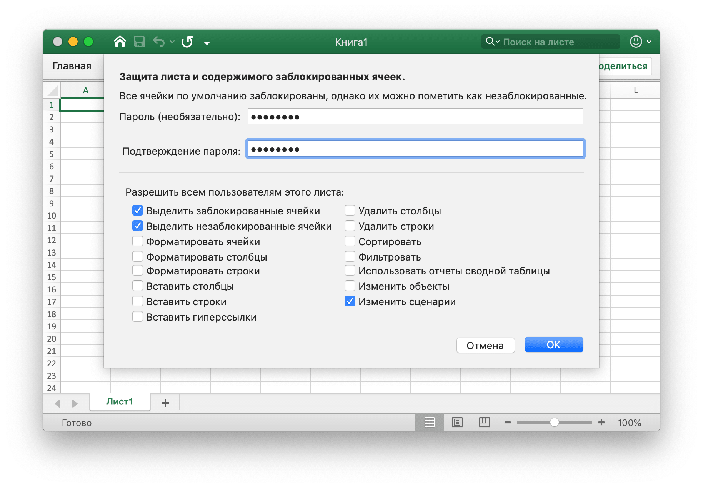

# Рабочий лист

## Установить видимость столбца {#SetColVisible}

```go
func (f *File) SetColVisible(sheet, column string, visible bool)
```

SetColVisible предоставляет функцию для установки видимости одного столбца с помощью имени рабочего листа и имени столбца. Например, скройте столбец `D` в `Sheet1`:

```go
xlsx.SetColVisible("Sheet1", "D", false)
```

## Установить ширину столбца {#SetColWidth}

```go
func (f *File) SetColWidth(sheet, startcol, endcol string, width float64)
```

SetColWidth предоставляет функцию для установки ширины одного столбца или нескольких столбцов. Например:

```go
xlsx := excelize.NewFile()
xlsx.SetColWidth("Sheet1", "A", "H", 20)
err := xlsx.Save()
if err != nil {
    fmt.Println(err)
}
```

## Установить высоту строки {#SetRowHeight}

```go
func (f *File) SetRowHeight(sheet string, row int, height float64)
```

SetRowHeight предоставляет функцию для установки высоты одной строки. Например, установите высоту первой строки в `Sheet1`:

```go
xlsx.SetRowHeight("Sheet1", 1, 50)
```

## Установить видимость линии {#SetRowVisible}

```go
func (f *File) SetRowVisible(sheet string, rowIndex int, visible bool)
```

SetRowVisible предоставляет функцию для отображения видимости одной строки с помощью заданного имени листа и индекса строки. Например, скройте строку `2` в `Sheet1`:

```go
xlsx.SetRowVisible("Sheet1", 2, false)
```

## Получить имя листа {#GetSheetName}

```go
func (f *File) GetSheetName(index int) string
```

GetSheetName предоставляет функцию для получения имени рабочего листа XLSX с помощью указанного индекса рабочего листа. Если заданный индекс листа недействителен, он вернет пустую строку.

## Получить видимость столбца {#GetColVisible}

```go
func (f *File) GetColVisible(sheet, column string) bool
```

GetColVisible предоставляет функцию, чтобы получить видимость одного столбца с помощью имени рабочего листа и имени столбца. Например, получите видимое состояние столбца `D` в `Sheet1`:

```go
xlsx.GetColVisible("Sheet1", "D")
```

## Получить ширину столбц {#GetColWidth}

```go
func (f *File) GetColWidth(sheet, column string) float64
```

GetColWidth предоставляет функцию для получения ширины столбца с помощью имени рабочего листа и индекса столбца.

## Получить высоту строки {#GetRowHeight}

```go
func (f *File) GetRowHeight(sheet string, row int) float64
```

GetRowHeight предоставляет функцию для получения высоты строки с помощью заданного имени листа и индекса строки. Например, получить высоту первой строки в `Sheet1`:

```go
xlsx.GetRowHeight("Sheet1", 1)
```

## Получить видимость строки {#GetRowVisible}

```go
func (f *File) GetRowVisible(sheet string, rowIndex int) bool
```

GetRowVisible предоставляет функцию, чтобы получить видимость одной строки, указав имя листа и индекс строки. Например, получить видимое состояние строки `2` в `Sheet1`:

```go
xlsx.GetRowVisible("Sheet1", 2)
```

## Получить индекс рабочего листа {#GetSheetIndex}

```go
func (f *File) GetSheetIndex(name string) int
```

GetSheetIndex предоставляет функцию для получения индекса рабочего листа XLSX с помощью имени листа. Если заданное имя листа недопустимо, возвращается целочисленное значение типа `0`.

Полученный индекс может использоваться как параметр для вызова функции [`SetActiveSheet()`](workbook.md#SetActiveSheet) при настройке рабочего листа по умолчанию для рабочей книги.

## Получить список рабочих листов {#GetSheetMap}

```go
func (f *File) GetSheetMap() map[int]string
```

GetSheetMap предоставляет функцию для получения имени рабочего листа и индексной карты XLSX. Например:

```go
xlsx, err := excelize.OpenFile("./Book1.xlsx")
if err != nil {
    return
}
for index, name := range xlsx.GetSheetMap() {
    fmt.Println(index, name)
}
```

## Получить свойства листа {#GetSheetPrOptions}

```go
func (f *File) GetSheetPrOptions(name string, opts ...SheetPrOptionPtr) error
```

GetSheetPrOptions обеспечивает функцию для получения свойств листа.

|Необязательный атрибут|Тип|
|---|---|
|CodeName|string|
|EnableFormatConditionsCalculation|bool|
|Published|bool|
|FitToPage|bool|
|AutoPageBreaks|bool|
|OutlineSummaryBelow|bool|

Например:

```go
xl := excelize.NewFile()
const sheet = "Sheet1"

var (
    codeName                          excelize.CodeName
    enableFormatConditionsCalculation excelize.EnableFormatConditionsCalculation
    published                         excelize.Published
    fitToPage                         excelize.FitToPage
    autoPageBreaks                    excelize.AutoPageBreaks
    outlineSummaryBelow               excelize.OutlineSummaryBelow
)

if err := xl.GetSheetPrOptions(sheet,
    &codeName,
    &enableFormatConditionsCalculation,
    &published,
    &fitToPage,
    &autoPageBreaks,
    &outlineSummaryBelow,
); err != nil {
    panic(err)
}
fmt.Println("Defaults:")
fmt.Printf("- codeName: %q\n", codeName)
fmt.Println("- enableFormatConditionsCalculation:", enableFormatConditionsCalculation)
fmt.Println("- published:", published)
fmt.Println("- fitToPage:", fitToPage)
fmt.Println("- autoPageBreaks:", autoPageBreaks)
fmt.Println("- outlineSummaryBelow:", outlineSummaryBelow)
```

Вывод:

```text
Defaults:
- codeName: ""
- enableFormatConditionsCalculation: true
- published: true
- fitToPage: false
- autoPageBreaks: false
- outlineSummaryBelow: true
```

## Вставить столбец {#InsertCol}

```go
func (f *File) InsertCol(sheet, column string)
```

InsertCol предоставляет функцию для вставки нового столбца перед указателем столбца. Например, создайте новый столбец перед столбцом `C` в `Sheet1`:

```go
xlsx.InsertCol("Sheet1", "C")
```

## Вставить строку {#InsertRow}

```go
func (f *File) InsertRow(sheet string, row int)
```

InsertRow предоставляет функцию для вставки новой строки перед указателем строки. Например, создайте новую строку перед строкой `3` в `Sheet1`:

```go
xlsx.InsertRow("Sheet1", 2)
```

## Добавить дубликат строки {#DuplicateRow}

```go
func (f *File) DuplicateRow(sheet string, row int)
```

DuplicateRow вставляет копию указанной строки ниже указанной, например:

```go
xlsx.DuplicateRow("Sheet1", 2)
```

Используйте этот метод с осторожностью, что повлияет на изменения в ссылках, таких как формулы, диаграммы и т. Д. Если на листе есть какое-либо ссылочное значение, это приведет к ошибке файла при его открытии. Excelize лишь частично обновляет эти ссылки в настоящее время.

## Дублирующая строка {#DuplicateRowTo}

```go
func (f *File) DuplicateRowTo(sheet string, row, row2 int)
```

DuplicateRowTo вставляет копию указанной строки в указанную позицию строки, перемещаясь вниз на существующие строки после целевой позиции, например:

```go
xlsx.DuplicateRowTo("Sheet1", 2, 7)
```

Используйте этот метод с осторожностью, что повлияет на изменения в ссылках, таких как формулы, диаграммы и т. Д. Если на листе есть какое-либо ссылочное значение, это приведет к ошибке файла при его открытии. Excelize лишь частично обновляет эти ссылки в настоящее время.

## Создать схему строки {#SetRowOutlineLevel}

```go
func (f *File) SetRowOutlineLevel(sheet string, rowIndex int, level uint8)
```

SetRowOutlineLevel предоставляет функцию для установки уровня уровня строки в одной строке с помощью заданного имени листа и индекса строки. Например, контур 2 строки в `Sheet1` до уровня 1:



```go
xlsx.SetRowOutlineLevel("Sheet1", 2, 1)
```

## Создать контур столбца {#SetColOutlineLevel}

```go
func (f *File) SetColOutlineLevel(sheet, column string, level uint8)
```

SetColOutlineLevel предоставляет функцию для установки уровня контуров одного столбца с помощью имени рабочего листа и имени столбца. Например, установите уровень контуров столбца `D` в `Sheet1` равным 2:

<p align="center"></p>

```go
xlsx.SetColOutlineLevel("Sheet1", "D", 2)
```

## Получить контур линии {#GetRowOutlineLevel}

```go
func (f *File) GetRowOutlineLevel(sheet string, rowIndex int) uint8
```

GetRowOutlineLevel предоставляет функцию, позволяющую получить общий уровень уровня одной строки с помощью заданного имени листа и индекса строки. Например, получите количество строк строки 2 в `Sheet1`:

```go
xlsx.GetRowOutlineLevel("Sheet1", 2)
```

## Получить контур колонны {#GetColOutlineLevel}

```go
func (f *File) GetColOutlineLevel(sheet, column string) uint8
```

GetColOutlineLevel предоставляет функцию для получения уровня контуров одного столбца с указанием имени рабочего листа и имени столбца. Например, получите уровень контуров столбца `D` в `Sheet1`:

```go
xlsx.GetColOutlineLevel("Sheet1", "D")
```

## Ряд итератора {#Rows}

```go
func (f *File) Rows(sheet string) (*Rows, error)
```

Строки возвращают итератор строк. Например:

```go
rows, err := xlsx.Rows("Sheet1")
for rows.Next() {
    for _, colCell := range rows.Columns() {
        fmt.Print(colCell, "\t")
    }
    fmt.Println()
}
```

### Итератор строк - Столбцы

```go
func (rows *Rows) Columns() []string
```

Columns возвращают значения столбцов текущей строки.

### Итератор строк - перемещение

```go
func (rows *Rows) Next() bool
```

Next вернется `true`, если найдет следующий элемент строки.

### Итератор строк - обработка ошибок

```go
func (rows *Rows) Error() error
```

Error вернет `error`, когда найдет следующий элемент строки.

## Поиск на листе {#SearchSheet}

```go
func (f *File) SearchSheet(sheet, value string, reg ...bool) []string
```

SearchSheet предоставляет функцию для получения координат с помощью заданного имени листа и значения ячейки. Эта функция поддерживает только точное соответствие строк и чисел, не поддерживает вычисляемый результат, отформатированные числа и условный поиск в настоящее время. Если это объединенная ячейка, она вернет координаты верхнего левого угла объединенной области.

Например, найдите координаты значения `100` на `Sheet1`:

```go
xlsx.SearchSheet("Sheet1", "100")
```

Например, найдите координаты значения в диапазоне `0-9` на листе с именем `Sheet1`:

```go
xlsx.SearchSheet("Sheet1", "[0-9]", true)
```

## Защитить лист {#ProtectSheet}

```go
func (f *File) ProtectSheet(sheet string, settings *FormatSheetProtection)
```

ProtectSheet предоставляет функцию предотвращения случайного или преднамеренного изменения других пользователей, перемещения или удаления данных на листе. Например, защитите `Sheet1` с настройками защиты:



```go
xlsx.ProtectSheet("Sheet1", &excelize.FormatSheetProtection{
    Password:      "password",
    EditScenarios: false,
})
```

## Снять защиту листа {#UnprotectSheet}

```go
func (f *File) UnprotectSheet(sheet string)
```

UnprotectSheet предоставляет функцию для снятия защиты листа Excel.
